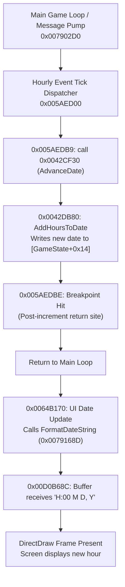

# Darkest Hour Hourly Tick & Game Loop Debugging

This skill provides verified, replicable instructions, addresses, memory structures, and debugger protocols for single-stepping Darkest Hour (v1.05.2, checksum TENE, 32-bit x86) exactly one hour per iteration using x32dbg.

---

## Quick Reference (TL;DR)

| Item | Value / Address | Description |
|---|---|---|
| **Post-Tick Breakpoint** | `0x005AEDBE` | Return site right after `AdvanceDate(1)`. Breaks once per hour after date increment. |
| **Pre-Tick Breakpoint** | `0x005AEDB9` | Call instruction `call 0x0042CF30`. Breaks once per hour right before date increment. |
| **AdvanceDate Function** | `0x0042CF30` | Top-level hourly advance function (with SEH frame). |
| **AddHoursToDate Function**| `0x0042DB80` | Arithmetic function: converts date to absolute hours, adds delta, converts back. |
| **Hour Byte Write Site** | `0x0042DC11` | `mov byte ptr [ecx], dl` (writes new hour byte). |
| **FormatDateString** | `0x0079168D` | Formats `"H:00 M D, Y"` into buffer at `0x00D0B68C`. |
| **UI Date Update Site** | `0x0064B170` | Calls `FormatDateString` and invalidates the top bar clock widget. |
| **Game State Pointer** | `[0x00893530]` | Global pointer to `GameState` in heap. |
| **Date Struct Offset** | `+0x14` | Struct at `[0x00893530] + 0x14` (6-byte packed date). |
| **UI String Buffer** | `0x00D0B68C` | ASCII string buffer displayed in UI (e.g. `"6:00 July 4, 1936"`). |

---

## 1. Single-Hour Stepping Procedure

To advance the game loop by exactly one in-game hour per step:

1. **Clear existing breakpoints** in x32dbg to prevent spurious halts:
   ```json
   {"action": {"action": "delete", "address": "<old_address>", "type": "software"}}
   ```
2. **Set a software breakpoint at `0x005AEDBE`**:
   ```json
   {"action": {"action": "set_software", "address": "0x005AEDBE"}}
   ```
3. **Resume execution (Run / F9)**:
   ```json
   {"action": {"action": "run"}}
   ```
4. **On breakpoint hit**, the game has completed one hour tick:
   - The memory date struct has incremented by `+1` hour.
   - The UI top-bar clock widget displays the completed hour.
5. **Inspect memory** to verify the new date:
   - Read 6 bytes from pointer `[0x00893530] + 0x14`.
6. **Press F9 again** to advance to the next hour.

---

## 2. In-Game Date Memory Structure

Darkest Hour stores the current date in a 6-byte packed struct located at offset `+0x14` of the `GameState` object (`[0x00893530] + 0x14`):

```
+0x00: byte   hour    (0 - 23)
+0x01: byte   day     (0 - 29, 0-indexed: day 3 = 4th of month)
+0x02: byte   month   (0 - 11, 0-indexed: Jan=0, Jul=6)
+0x03: byte   flags   (padding / internal flags)
+0x04: uint16 year    (16-bit word, e.g. 1936 = 0x0790)
```

### Date Reading Example (Hex Dump)
```
05 03 06 BA 90 07
-- -- -- -- -----
|  |  |  |  `-- Year:  0x0790 = 1936
|  |  |  `----- Flags: 0xBA
|  |  `-------- Month: 0x06 (July, 0-indexed)
|  `----------- Day:   0x03 (4th, 0-indexed)
`-------------- Hour:  0x05 (5:00)
```
Interpreted as: **5:00 July 4, 1936**.

---

## 3. Date Arithmetic Engine (`0x0042DB80`)

Darkest Hour uses a standardized 360-day calendar (12 months of 30 days):
- **8640 hours / year** (`0x21C0`): $360 \times 24$
- **720 hours / month** (`0x2D0`): $30 \times 24$
- **24 hours / day** (`0x18`)

The routine at `0x0042DB80` (`AddHoursToDate`):
1. Converts the current `{year, month, day, hour}` into an absolute hour integer.
2. Adds the hour delta passed on stack (normally `+1`).
3. Computes the new date fields via division:
   - `year  = total_hours / 8640`
   - `month = (total_hours % 8640) / 720`
   - `day   = (total_hours % 720) / 24`
   - `hour  = total_hours % 24`
4. Writes the hour byte to `[ecx]` at instruction `0x0042DC11`.

---

## 4. Game Loop & UI Pipeline



---

## 5. Critical Debugger & Tooling Rules

### A. x64dbg MCP Tool Calling Conventions
Every tool in the `x64dbg` MCP server requires parameters wrapped inside an `action` object:
```json
// Example: Resume execution
call_mcp_tool(
  ServerName="x64dbg",
  ToolName="x64dbg_debug",
  Arguments={"action": {"action": "run"}}
)

// Example: Set breakpoint
call_mcp_tool(
  ServerName="x64dbg",
  ToolName="x64dbg_breakpoints",
  Arguments={"action": {"action": "set_software", "address": "0x005AEDBE"}}
)

// Example: Read date struct
call_mcp_tool(
  ServerName="x64dbg",
  ToolName="x64dbg_memory",
  Arguments={"action": {"action": "read", "address": "<date_addr>", "size": 6}}
)
```

### B. Windows Screenshot Parameters
When capturing screenshots while the game process is frozen in the debugger, ALWAYS provide these exact parameters to `screenshot_control`:
```json
{
  "action": "capture",
  "annotate": false,
  "outputMode": "inline",
  "target": "window",
  "imageFormat": "png",
  "windowHandle": "<HWND>"
}
```
* **Avoid Window Occlusion**: If another window completely covers the game window, DWM may return a stale cached frame. Minimize or move occluding windows.
* **NEVER call `window_management` `activate`** on a debugger-paused game window. Calling `SetForegroundWindow` on a thread frozen by a debugger will deadlock the tool call until timeout (3 minutes).

### C. Safe Disassembly
Avoid calling `x64dbg_disassembly` with `action: "function"` on large game loop functions containing non-ASCII comments, as it can fail with encoding errors. Instead, use `action: "at_address"` with a specific `count` (20 to 50 instructions).
