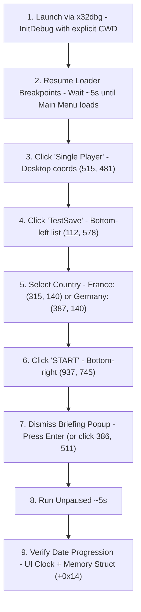

---
name: dh-savegame-flow
description: >-
  Automated UI control flow and coordinate reference for Darkest Hour (checksum TENE) under x32dbg via Windows MCP.
---

# Darkest Hour Savegame Loading & UI Automation Flow

This skill provides verified coordinates, window geometry, debugger launch instructions, and input procedures for driving **Darkest Hour** (v1.05.2, checksum TENE, 32-bit x86) through its main menu to load a savegame and verify date progression using the Windows MCP and x64dbg MCP.

---

## 1. Quick Reference: Coordinate & Element Lookup

All coordinates below are for **1024x768 windowed mode** positioned at desktop origin `(2, 0)` with standard Windows borders (`[2, 0, 1026, 797]`).

### A. Main Menu Stack (Horizontal Center: `X = 515`)
Button width: 175px (`X: 428..603`), Height: 27px, Gap: 13px, Pitch: 40px ($Y_k = 441 + 40 \times k$).

| Button | Desktop `(X, Y)` | Screenshot `(X, Y)` | Y-Range | Notes |
|---|---|---|---|---|
| **Tutorial** ($k=0$) | `(515, 441)` | `(513, 441)` | `428..455` | Topmost button |
| **Single Player** ($k=1$) | `(515, 481)` | `(513, 481)` | `468..495` | **TARGET: Opens scenario & save selection** |
| **Multiplayer** ($k=2$) | `(515, 521)` | `(513, 521)` | `508..535` | |
| **Credits** ($k=3$) | `(515, 561)` | `(513, 561)` | `548..575` | |
| **Exit** ($k=4$) | `(515, 601)` | `(513, 601)` | `588..615` | **THE TRAP! 120px below Single Player** |

### B. Scenario & Saved Game Selection Screen
Window bounds: `[2, 0, 1026, 797]`.

| Element | Desktop `(X, Y)` | Bounds / Range | Notes |
|---|---|---|---|
| **TestSave** (Saved Game) | `(112, 578)` | `X: 51..282, Y: 574..581` | 3rd entry in bottom-left 'SAVED GAMES' list |
| **France Flag** (Country) | `(315, 140)` | `X: 293..334, Y: 107..174` | Vertical tricolor banner above label 'France' |
| **Germany Flag** (Country)| `(387, 140)` | `X: 365..406, Y: 107..174` | Ahistoric German war flag banner (Iron Cross) above 'Germany' |
| **OPTIONS** Button | `(610, 745)` | `X: 540..680, Y: 731..760` | Bottom control strip |
| **BACK** Button | `(770, 745)` | `X: 700..840, Y: 731..760` | Bottom control strip |
| **START** Button | `(937, 745)` | `X: 865..1005, Y: 731..760`| **TARGET: Bottom-right button** |

### C. Scenario Briefing Dialog & Clock
| Element | Desktop `(X, Y)` | Bounds / Range | Notes |
|---|---|---|---|
| **START GAME!** Button | `(386, 511)` | `X: 322..451, Y: 495..527` | **Dynamic position** (varies with text); **press Enter instead** |
| **UI Clock Widget** | `(850, 100)` | Top-right header | Buffer at `0x00D0B68C` ('H:00 Month D, Y') |

---

## 2. Complete Execution Flow



### Step 1: Launch Under Debugger
Always pass the game root directory as the **third argument** (working directory) to `InitDebug` to prevent scenario enumeration failures:
```json
{
  "ServerName": "x64dbg",
  "ToolName": "x64dbg_command",
  "Arguments": {
    "action": {
      "action": "execute",
      "command": "InitDebug \"E:\\Program Files (x86)\\Steam\\steamapps\\common\\Darkest Hour A HOI Game\\Darkest Hour.exe\", \"\", \"E:\\Program Files (x86)\\Steam\\steamapps\\common\\Darkest Hour A HOI Game\""
    }
  }
}
```

### Step 2: Clear Obstructions & Resume
Move the x32dbg window to `[1047, 0, 870, 632]` so it does not occlude the game window at `(2, 0)`. Resume execution (`action: "run"`) past loader/DLL breakpoints until `state: "running"`, then wait ~5 seconds for the main menu to load.

### Step 3: Click 'Single Player'
Use `mouse_control` with `target="primary_screen"` at `(515, 481)`:
```json
{"action": "click", "target": "primary_screen", "x": 515, "y": 481}
```

### Step 4: Click 'TestSave'
Select the save game in the bottom-left list at `(112, 578)`:
```json
{"action": "click", "target": "primary_screen", "x": 112, "y": 578}
```

### Step 5: Select Country (France or Germany)
Select the desired country banner in the top center:
- **France** (tricolor banner above label 'France'):
  ```json
  {"action": "click", "target": "primary_screen", "x": 315, "y": 140}
  ```
- **Germany** (ahistoric war flag with Iron Cross above label 'Germany'):
  ```json
  {"action": "click", "target": "primary_screen", "x": 387, "y": 140}
  ```

### Step 6: Click 'START'
Click the bottom-right start button at `(937, 745)`:
```json
{"action": "click", "target": "primary_screen", "x": 937, "y": 745}
```
Wait ~3 seconds for scenario loading.

### Step 7: Dismiss Briefing Popup ('START GAME!')
> [!TIP]
> **Keyboard Shortcut**: The briefing dialog dimensions and button position can vary depending on scenario description text length. However, it can be dismissed cleanly without coordinates by sending an `Enter` keypress:
> ```json
> {"action": "press", "key": "enter", "windowHandle": "<HWND>"}
> ```
> Alternatively, if using mouse click on standard 1936 saves, target `(386, 511)`.

### Step 8: Verify Date Counter
1. **Top-Right UI Clock**: Top-right text advances from `0:00 July 4, 1936` to `6:00 July 4, 1936` (after ~5s).
2. **Engine Memory Struct**: Read 6 bytes at `[0x00893530] + 0x14` (`hour, day, month, flags, year_low, year_high`):
   - `Byte 0 (Hour)`: Increments `0x00` -> `0x01` -> `0x02` ...
   - `Byte 1 (Day)`: `0x03` (4th of month, 0-indexed).
   - `Byte 2 (Month)`: `0x06` (July, 0-indexed).
   - `Bytes 4-5 (Year)`: `0x0790` (1936).

---

## 3. Screen Coordinate Mapping & Pitfalls

When locating any element on screen during automation, keep these fundamental principles in mind:

### 1. Frame Geometry & Coordinate Conversion
Darkest Hour runs in a 1024x768 DirectDraw canvas. In windowed mode on Windows 10/11:
- **Title Bar**: Non-client height = **31px** ($Y = 0..30$).
- **Borders**: 3px left, right, and bottom.
- **Window Screenshot vs Desktop**:
  - `screenshot_control(target="window")` captures the full window frame including title bar ($1030 \times 799$).
  - For a window positioned at desktop `(2, 0)`:
    $$X_{\text{screen}} = 2 + X_{\text{screenshot}}$$
    $$Y_{\text{screen}} = 0 + Y_{\text{screenshot}}$$
  - If calculating relative to the internal **client area** (1024x768 canvas without title bar):
    $$X_{\text{screen}} = 2 + 3 + X_{\text{client}} = 5 + X_{\text{client}}$$
    $$Y_{\text{screen}} = 0 + 31 + Y_{\text{client}} = 31 + Y_{\text{client}}$$

### 2. The 31px vs 40px Trap
Main menu buttons are spaced by a pitch of **40px** (27px height + 13px gap).
Because the window title bar is **31px**, mixing up client coordinates with window coordinates shifts clicks by approximately one button position down the stack. Compounding offsets or applying an offset twice quickly pushes the click from Single Player ($Y = 481$) straight into Exit ($Y = 601$).

### 3. The Hover Luminescence Feedback Loop
- Idle buttons have dark metallic textures (RGB ~ 80..120).
- Hovered buttons turn bright glowing cream/white (RGB > 210).
- **Never use dynamic pixel-brightness scanning** to detect button coordinates. If the cursor previously brushed over the bottom of the window, Exit lights up bright white, tricking vision scripts into selecting it. Use known-good static coordinates instead.

### 4. Static vs Dynamic UI Elements
- **Static Elements**: All main menu buttons, scenario selection lists, country flags, and bottom action buttons have fixed, hardcoded coordinates across all runs at 1024x768.
- **Dynamic Elements**: Modal dialogs with variable text length (e.g. Scenario Briefing) expand dynamically. Rely on keyboard shortcuts (`Enter` / `Esc`) rather than absolute click coordinates for modal dialogs.

---

## 4. Capturing Screenshots

When `Darkest Hour.exe` is frozen by a breakpoint or paused in x32dbg, its Win32 message pump is stopped and the DirectDraw surface cannot process standard GDI or window-capture messages.

To successfully capture screenshots while frozen without hanging or returning empty/stale frames:

- **Mandatory Screenshot Parameters**:
   Always pass these exact parameters to `screenshot_control`:
   ```json
   {
     "action": "capture",
     "annotate": false,
     "outputMode": "inline",
     "target": "window",
     "imageFormat": "png",
     "windowHandle": "<HWND>"
   }
   ```

- **Deadlock Caution on Paused Windows**:
   * **NEVER call `window_management(action="activate")`** on a debugger-paused window.
   * Calling `SetForegroundWindow` on a frozen thread forces Windows to wait for the message queue to synchronize, causing the MCP tool call to deadlock until the 180-second timeout expires.