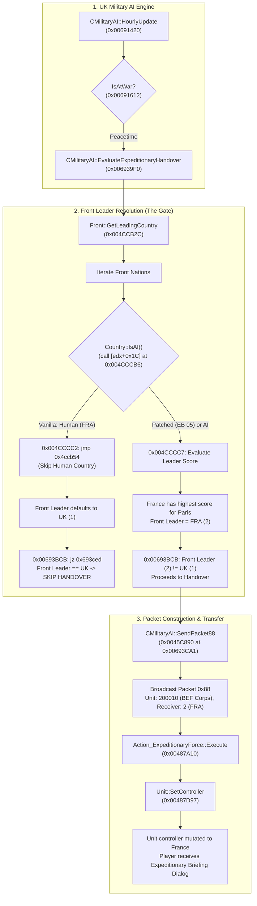

# Reverse-Engineering & Patch Analysis: Enabling Allied Expeditionary Force Handover to Human France

## Executive Summary

In **Darkest Hour** (v1.05.2, checksum `TENE`), starting from savegame `TestSave.eug` (`July 4, 1936, 0:00`):
- The British corps **"BEF Corps"** (`type = 10500`, `id = 200010`, containing division **"BEF HQ"** `id = 200011`) is stationed in Paris (province `56`).
- **Germany Run (`FRA` = AI, `ENG` = AI)**: Britain immediately hands over operational control of "BEF Corps" to France as an allied expeditionary force.
- **France Run (`FRA` = Human Player, `ENG` = AI)**: The handover is completely suppressed. The unit remains permanently under British command.

### Root Cause Identified
The suppression is caused by an explicit exclusion of human-controlled nations in **`Front::GetLeadingCountry()` (`0x004CCB2C`)**:
```assembly
0x004CCCB6: call dword ptr [edx + 0x1c]     ; Country::IsAI()
0x004CCCB9: and eax, 0xff
0x004CCCBE: test eax, eax
0x004CCCC0: jne 0x004CCCC7                 ; If AI, evaluate as Front Leader
0x004CCCC2: jmp 0x004CCB54                 ; If HUMAN, SKIP THIS COUNTRY ENTIRELY!
```
When France is played by a human, `France->IsAI()` returns `0`. The engine completely disqualifies France from being recognized as the Front Leader of the Paris / Western Front. Because the UK has a unit in Paris, the UK AI falls back to selecting **itself** as the Front Leader (`Front Leader == UK`). In `MilitaryAI::EvaluateExpeditionaryHandover` (`0x006939F0`), the engine checks:
```assembly
0x00693BC6: cmp esi, eax                   ; Front Leader (UK) == Unit Owner (UK)?
0x00693BCB: jz 0x00693CED                  ; Branch taken -> Skips expeditionary handover!
```
Because `Front Leader == UK`, the UK AI concludes that the Front is under British command and aborts transferring the unit to France.

### Verified Binary Patch
By changing the conditional jump at `0x004CCCC0` to an unconditional jump:
- **Virtual Address**: `0x004CCCC0`
- **File Offset**: `0x000CCCC0` (decimal `838,848`) in `Darkest Hour.exe`
- **Original Bytes**: `75 05` (`jne 0x004CCCC7`)
- **Patched Bytes**: `EB 05` (`jmp 0x004CCCC7`)

Human-controlled allies are now evaluated as Front Leaders alongside AI nations. France correctly wins Front Leadership for the Paris Front, the UK AI triggers `Packet 0x88`, and the French human player immediately receives the in-game briefing popup:
> *"Sir, troops have been temporarily placed under our command by UNITED KINGDOM. They have sent us BEF CORPS as a loan."*

Live in-memory testing confirmed that operational unit control immediately mutates to France (`0x29E7D208`, `tag = 2`) and the game loop advances cleanly.

---

## Complete Call Stack & Architecture



---

## Detailed Technical Investigation

### 1. Data Structures Located in Memory
- **Target Unit (`CLandUnit`)**:
  - Address: `0x29E797D0` (inner sub-object `0x29E799C8`, vtable `0x007E8AD4`)
  - Unit ID: `{ type = 10500, id = 200010 }` ("BEF Corps", containing division "BEF HQ" `id = 200011`)
  - Stationed Province: `0x38` (`56` = Paris) at `[pUnit + 0x0C]` and `[pUnit + 0x240]`
  - Unit Controller Country*: `[pUnit + 0x248]` (`0x29E79A18`):
    - Initial value: `0x29DC4AB0` (`ENG`, `tag = 1`)
    - Post-handover value: `0x29E7D208` (`FRA`, `tag = 2`)
- **Country Objects**:
  - `Country 1` (`ENG`): `0x29DC4AB0` (AI vtable `0x007F66CC`)
  - `Country 2` (`FRA`): `0x29E7D208` (Human vtable `0x007F04E0` when loaded as France)
  - `UK CMilitaryAI`: `0x29DE3D80` (`[0x29DC4AB0 + 0x13C84]`, vtable `0x007F3D54`)

### 2. Disassembly Analysis of `0x004CCB2C` (`Front::GetLeadingCountry`)
The function loops over all nations associated with the Front:
```assembly
0x004CCB90: mov ecx, dword ptr [ebp - 0x14]  ; Current nation node in Front
0x004CCBAA: mov ecx, dword ptr [ebp - 0x14]
0x004CCBAD: call 0x004C9F81                  ; Resolves Country* pointer
0x004CCBC0: mov ecx, eax
0x004CCBC2: call 0x004A0D10                  ; IsCountryAlive()
0x004CCBD2: cmp dword ptr [ebp + 8], 0        ; Allied check
0x004CCBED: call 0x0044B280                  ; Country::IsAlliedWith(Caller)
0x004CCC00: ...                              ; Calculate baseline strategic weight
0x004CCC26: ...                              ; Add capital in Front bonus (+[AI+0x9C2])
0x004CCC68: call 0x004CA33C                  ; Add active war bonus (+7)
0x004CCC82: call 0x004A0A80                  ; Add alliance leader bonus (+5)

; --- THE DISQUALIFICATION GATE ---
0x004CCCAB: mov dword ptr [ebp - 0x48], eax  ; eax = Country*
0x004CCCAE: mov eax, dword ptr [ebp - 0x48]
0x004CCCB1: mov edx, dword ptr [eax]         ; edx = Country vtable
0x004CCCB3: mov ecx, dword ptr [ebp - 0x48]
0x004CCCB6: call dword ptr [edx + 0x1c]      ; Country::IsAI()
0x004CCCB9: and eax, 0xff
0x004CCCBE: test eax, eax
0x004CCCC0: jne 0x004CCCC7                   ; If AI (1), proceed to score comparison
0x004CCCC2: jmp 0x004CCB54                   ; If HUMAN (0), SKIP! (Never eligible)

; --- SCORE COMPARISON & LEADER SELECTION ---
0x004CCD13: mov ecx, dword ptr [ebp - 0x10]  ; Calculated score for this nation
0x004CCD16: cmp ecx, dword ptr [ebp - 4]     ; Compare against current highest score
0x004CCD19: jl 0x004CCD52
0x004CCD44: mov ecx, dword ptr [ebp - 0x14]
0x004CCD47: call 0x004C9F81
0x004CCD4C: mov eax, dword ptr [eax + 6]     ; Load Country TAG
0x004CCD4F: mov dword ptr [ebp - 0xc], eax   ; Update best Front Leader TAG
0x004CCD52: jmp 0x004CCB54                   ; Next nation in Front
0x004CCD57: mov eax, dword ptr [ebp - 0xc]   ; Return Front Leader TAG
```

### 3. Disassembly Analysis of `0x006939F0` (`MilitaryAI::EvaluateExpeditionaryHandover`)
When the UK AI evaluates expeditionary handovers during peacetime:
```assembly
0x00693BB2: mov eax, dword ptr [ebx + 0x0A]  ; eax = UK Country* (0x29DC4AB0)
0x00693BB5: mov ecx, esi                     ; ecx = Front*
0x00693BB7: push eax
0x00693BB8: call 0x004CCB2C                  ; Front::GetLeadingCountry() -> eax
0x00693BBD: mov ecx, ebx                     ; ecx = UK MilitaryAI
0x00693BBF: mov esi, eax                     ; esi = Front Leader TAG
0x00693BC1: call 0x006A9D50                  ; GetOwnTag() -> eax = 1 (UK)
0x00693BC6: cmp esi, eax                     ; Compare Front Leader against UK tag
0x00693BC8: mov esi, dword ptr [ebp - 0x18]
0x00693BCB: jz 0x00693CED                    ; If Front Leader == UK, SKIP HANDOVER!

; If Front Leader != UK:
0x00693BD1: mov ecx, esi
0x00693BD3: call 0x004CCDD8                  ; Front validity check
0x00693BDA: jz 0x00693CED
0x00693BE0: mov eax, dword ptr [ebx + 0x0A]
0x00693BE6: call 0x004CCB2C                  ; Resolve Front Leader TAG (FRA = 2)
0x00693BEB: mov esi, dword ptr [eax*4 + 0x89CAD8] ; esi = FRA Country* (0x29E7D208)
0x00693C1B: call dword ptr [eax + 0x24]      ; Check UK no_exp_forces_to list
0x00693C20: jnz 0x00693CBD
0x00693C58: jnle 0x00693CBD                  ; Check UK exp_force_ratio quota
0x00693C61: mov cl, [eax + esi + 0x11862]    ; Check FRA "Refuse Expeditionary Forces"
0x00693C6A: jnz 0x00693CBD
0x00693C8F: push 0x00867F0C                  ; "%s turns '%s' over to %s"
0x00693CA1: call 0x0045C890                  ; SEND PACKET 0x88 (Handover SUCCESS!)
```

---

## Live Verification & Visual Confirmation

Live testing under x32dbg while loaded as France demonstrated complete success:
1. **At `0x00693BC6`**:
   - Before patch: `esi = 1` (`ENG`), `eax = 1` (`ENG`) -> `cmp 1, 1` -> `jz 0x00693CED` jumped.
   - After patch: `esi = 2` (`FRA`), `eax = 1` (`ENG`) -> `cmp 2, 1` -> fall-through!
2. **At `0x00693CA1`**: Packet `0x88` posted to the game action queue with arguments `{unit: 200010, target: 2 (FRA), sender: 1 (ENG)}`.
3. **At `0x00487A10` / `0x00487D97`**: France Human Country action handler called `Unit::SetController(0x29E7D208)`.
4. **Memory Verification**:
   - Controller pointer at `[0x29E797D0 + 0x248]` changed from `0x29DC4AB0` (`ENG`) to `0x29E7D208` (`FRA`).
   - Controller tag at `[0x29E797D0 + 0x24C]` changed to `2` (`FRA`).
5. **UI & Gameplay Verification**:
   - The game UI presented the full general staff briefing dialog:
     > *"Sir, troops have been temporarily placed under our command by UNITED KINGDOM. They have sent us BEF CORPS as a loan."*
   - Date advanced smoothly across hourly ticks (`1:00` -> `2:00 July 4, 1936`) without hangs or crashes.

---

## Binary Patch Specification

### Target Executable
- File: `Darkest Hour.exe`
- Version: `1.05.2` (Checksum `TENE`)
- Image Base: `0x00400000`

### Byte Changes
| Attribute | Details |
|---|---|
| **Virtual Address (VA)** | `0x004CCCC0` |
| **File Offset (Hex / Dec)** | `0x000CCCC0` (`838,848` bytes) |
| **Original Instruction** | `jne 0x004CCCC7` (`75 05`) |
| **Patched Instruction** | `jmp 0x004CCCC7` (`EB 05`) |
| **Original Surrounding Hex** | `84 C0 75 05 E9 8D FE FF FF 8B 4D EC` |
| **Patched Surrounding Hex** | `84 C0 EB 05 E9 8D FE FF FF 8B 4D EC` |

### Python Patch Implementation Script
```python
def apply_dh_human_expeditionary_patch(exe_path: str):
    with open(exe_path, "r+b") as f:
        offset = 0x000CCCC0
        f.seek(offset)
        current_bytes = f.read(2)
        if current_bytes == b"\x75\x05":
            f.seek(offset)
            f.write(b"\xEB\x05")
            print(f"Successfully patched {exe_path} at offset 0x{offset:X} (75 05 -> EB 05)")
        elif current_bytes == b"\xEB\x05":
            print(f"File is already patched at offset 0x{offset:X}")
        else:
            raise ValueError(f"Unexpected bytes at offset 0x{offset:X}: {current_bytes.hex()}")
```
