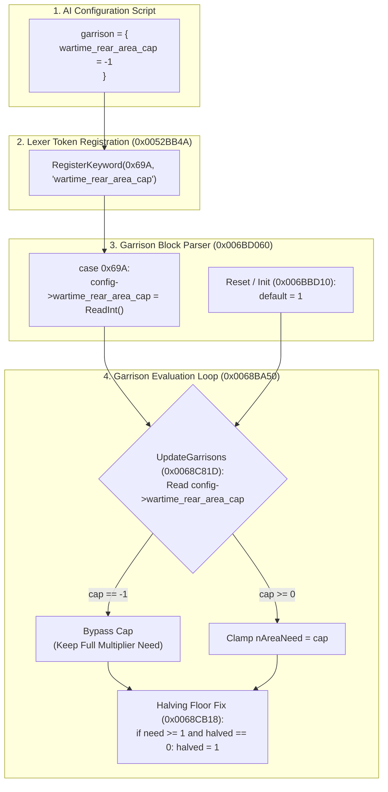

# Implementation Plan: Configurable `wartime_rear_area_cap` AI Setting

## Executive Summary

This document outlines the complete reverse-engineering analysis and binary patch specification to implement the new AI configuration parameter **`wartime_rear_area_cap`** in **Darkest Hour** (v1.05.2, checksum `TENE`).

### The Goal
Provide modders with full control over the engine's hardcoded wartime rear-area garrison ceiling inside `garrison = { ... }`:
* `wartime_rear_area_cap = 1` *(Default)*: Preserves vanilla behavior, but with the integer halving bug fixed so rear areas keep at least 1 division instead of being reduced to 0.
* `wartime_rear_area_cap = -1`: **Disables the cap entirely**, allowing rear areas and islands (such as Sardinia) to retain their full garrison quotas as configured by `area_multiplier` or `overseas_multiplier`.
* `wartime_rear_area_cap = N`: Sets a custom maximum division ceiling for rear areas during wartime.

---

## 1. Background & Root Cause Analysis

### The Engine's Two-Stage Collapse in `CGarrisonAI::UpdateGarrisons` (`0x0068BA50`)

When a nation is at war and has an active front line anywhere in the world (`front_areas_count > 0`), the engine evaluates every garrison area through two destructive stages:

#### Stage 1: The Hardcoded AI Non-Frontline Cap (`0x0068C7FB` – `0x0068C822`)
```assembly
0068c7f8: MOV ESI, [EBP - 0x2c]        ; ESI = calculated nAreaNeed (from area_multiplier)
0068c7fb: CMP ESI, 0x1                 ; Is nAreaNeed > 1?
0068c7fe: JLE 0x0068c825               ; If <= 1, skip
0068c800: MOV ECX, [EBX + 0xa]         ; Country pointer
0068c803: CALL 0x0044beb0              ; IsHuman(country)?
0068c808: TEST AL, AL
0068c80a: JNZ 0x0068c825               ; If human player, do NOT cap
0068c80c: MOV EAX, [EBP + 0xffffff60]  ; EAX = front_areas_count
0068c812: TEST EAX, EAX
0068c814: JLE 0x0068c825               ; If 0 active fronts (peacetime), do NOT cap
0068c816: MOV AL, [EBP - 0x1d]         ; Is THIS area an active front area?
0068c819: TEST AL, AL
0068c81b: JNZ 0x0068c825               ; If yes (frontline area), do NOT cap
0068c81d: MOV ESI, 0x1                 ; <-- HARDCODED CONSTANT 1!
0068c822: MOV [EBP - 0x2c], ESI        ; Overwrites nAreaNeed = 1!
```
* Because Sardinia is an island with no land borders to an enemy, `is_front_area == 0`.
* The engine unconditionally overwrites `nAreaNeed` with `1`, discarding the modder's `area_multiplier`.

#### Stage 2: The Wartime Halving Floor Collapse (`0x0068CB0F` – `0x0068CB1E`)
```assembly
0068cb0f: MOV EAX, [EBP - 0x2c]        ; EAX = nAreaNeed (which is 1 from Stage 1)
0068cb12: MOV ECX, [EBP - 0x44]        ; ECX = current divisions in area
0068cb15: CDQ
0068cb16: SUB EAX, EDX
0068cb18: SAR EAX, 1                   ; EAX = EAX / 2 (Integer shift right)
0068cb1a: MOV ESI, EAX                 ; ESI = Wartime nAreaNeed = floor(1 / 2) = 0!
0068cb1c: SUB EAX, ECX                 ; nAreaLack = 0 - current_divisions
0068cb1e: MOV [EBP - 0x24], EAX        ; nAreaLack becomes negative (all units = surplus!)
```
* Truncation bug: $\lfloor 1 / 2 \rfloor = 0$.
* The area's required quota becomes **0 divisions**. Every division present is flagged as surplus and shipped to the frontline whenever `war_zone_odds` demands reinforcements.

---

## 2. Architecture of the Solution

The solution consists of four integrated components in `Darkest Hour.exe`:



---

## 3. Detailed Component Specifications

### Component 1: Keyword Registration (`FUN_0052bb4a` @ `0x0052BB4A`)
* **Token ID**: `0x69A` (First available ID immediately following the highest registered token `0x699`).
* **Token String**: `"wartime_rear_area_cap"` (23 bytes including null terminator).
* **Storage**: Placed in existing code padding at `.text` or `.rdata`.
* **Registration Hook**: In `FUN_0052bb4a`, trampoline to a code cave that calls:
  ```assembly
  push offset s_wartime_rear_area_cap
  push 0x69a
  call FUN_005348d0
  ```

### Component 2: Storage in `CGarrisonAIConfig`
* `CGarrisonAIConfig` is located at `CAI + 0x2e0`.
* Offsets `+0x00` through `+0x80` store existing parameters (`home_multiplier`, `overseas_multiplier`, `home_peace_cap`, `war_zone_odds`, `area_multiplier` list).
* Offset **`+0x84`** is dedicated internal padding.
* **Storage Field**: `*(int *)(CGarrisonAIConfig + 0x84)` = `wartime_rear_area_cap`.

### Component 3: Parser Handling (`FUN_006bd060` @ `0x006BD060`)
* In `FUN_006bd060` (the garrison parser `switch(token)`):
  * When `token == 0x69A`:
    ```c
    *(int *)(param_1 + 0x84) = FUN_007a7b3c(param_2 + 0x104); // Read integer
    ```
* In `FUN_006bbd10` (the garrison config reset routine):
  * Set default value:
    ```c
    *(int *)(param_1 + 0x84) = 1; // Default to 1 (preserves 100% vanilla compatibility)
    ```

### Component 4: Dynamic Capping in `UpdateGarrisons` (`0x0068C81D`)
* Currently:
  ```assembly
  0068c81d: MOV ESI, 1
  0068c822: MOV [EBP - 0x2c], ESI
  0068c825: MOV ECX, [EBP - 0x44]
  ```
* Replace with hook:
  ```assembly
  MOV EDX, [EBP - 0x128]      ; EDX = CGarrisonAIConfig pointer
  MOV ESI, [EDX + 0x84]       ; ESI = wartime_rear_area_cap
  CMP ESI, -1                 ; Is cap disabled?
  JE bypass_cap               ; If -1, jump straight to 0x0068C825 (uncapped!)
  CMP [EBP - 0x2c], ESI       ; Is nAreaNeed > cap?
  JLE bypass_cap              ; If already <= cap, do not clamp
  MOV [EBP - 0x2c], ESI       ; Clamp to cap
  bypass_cap:
  ```

### Component 5: Wartime Halving Floor Fix (`0x0068CB18`)
* Currently:
  ```assembly
  0068cb18: SAR EAX, 1
  0068cb1a: MOV ESI, EAX
  ```
* Replace with:
  ```assembly
  SAR EAX, 1                  ; Integer halve
  TEST EAX, EAX               ; Did it drop to 0?
  JNZ is_nonzero
  CMP dword ptr [EBP - 0x2c], 0 ; Was original need > 0?
  JLE is_nonzero
  MOV EAX, 1                  ; Minimum floor of 1 division!
  is_nonzero:
  MOV ESI, EAX
  ```
* **Impact**: Ensures that when `wartime_rear_area_cap = 1` (the default), the area actually retains **1 division** instead of being evacuated down to **0**.

---

## 4. Modder Configuration Reference

Once applied, the setting can be used in any `.ai` file or directly in save file (e.g. `ai/default.ai`, `TestSave5.eug` etc.):

```text
garrison = {
    home_multiplier     = 2.0
    overseas_multiplier = 4.0
    home_peace_cap      = 20
    war_zone_odds       = 4.0
    
    # NEW PARAMETER:
    wartime_rear_area_cap = -1   # -1: Uncapped (respects area_multiplier & overseas_multiplier)
                                 #  1: Vanilla behavior (capped to 1 division)
                                 #  N: Custom maximum division ceiling
                                 
    area_multiplier = {
        43  = 8.0    # Dunkirk: with cap = -1, retains no less than floor(8 / 2) = 4 divisions!
    }
}
```

---

## 5. Verification & Testing Plan

Use **TestSave5** to verify the changes. In this save, England starts with 12 divisions in Dunkirk (#43) which is separated from the rest of the controlled zone and thus counts as its own area. The Dieppe/Amiens/Le Havre area (#42/#54/#41) is also owned by ENG, but it is a war zone area with 12 enemy divisions adjecent.

The current AI settings for ENG in TestSave5 are:
* war_zone_odds = 4 
* home_multiplier = 2 
* overseas_multiplier = 4 

1. **Uncapped Test (`wartime_rear_area_cap = -1`)**:
   * Set `wartime_rear_area_cap = -1` in `TestSave5.eug` under ENG's garrison AI.
   * Run `TestSave5`, allow 10 game days to pass (~10 seconds at high speed).
   * Verify that on July 10th or afterwards, Dunkirk still retains its calculated $\lfloor 4 / 2 \rfloor = 2$ divisions.
2. **Vanilla Compatibility Test (`wartime_rear_area_cap` omitted)**:
   *Remove `wartime_rear_area_cap = -1` in `TestSave5.eug` under ENG's garrison AI.
   *Run `TestSave5`, allow 10 game days to pass (~10 seconds at high speed).
   *Verify that on July 10th or afterwards, Dunkirk still retains exactly **1 division** instead of dropping to 0.
3. **Custom Ceiling Test (`wartime_rear_area_cap = 6`)**:
   * Set `wartime_rear_area_cap = 6` in `TestSave5.eug` under ENG's garrison AI.
   * Run `TestSave5`, allow 10 game days to pass (~10 seconds at high speed).
   * Verify that on July 10th or afterwards, Dunkirk still retains its calculated $\lfloor 6 / 2 \rfloor = 3$ divisions.
4. **Integration with `patch_darkest_hour.bat`**:
   * Add Patch 4 to `patch_darkest_hour.bat` with automated byte verification, SHA256 hashing, and 1-click apply/revert.

